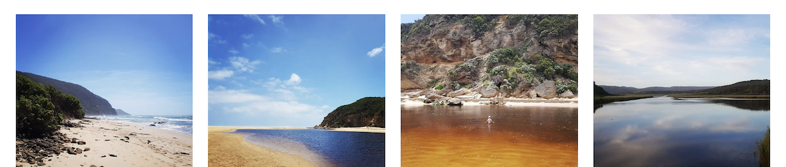

# React Instagram Authless Feed

 

Simple React component to render an Instagram feed from user name.

## Examples

- [repl.it](https://repl.it/@jamesmoriarty1/SizzlingNonstopCallbacks)
- [jamesmoriarty.xyz](http://www.jamesmoriarty.xyz/react-instagram-authless-feed/)

## Screenshots



## Install

```
npm install jamesmoriarty/react-instagram-authless-feed#v2.0.0
```

## Props

| Name             | Description                  | Required |
| ---------------- | ---------------------------- | -------- |
| userName         | Instagram user name.         | true     |
| className        | Container css class.         | false    |
| classNameLoading | Container loading css class. | false    |
| limit            | Limit media returned.        | false    |

## Usage

_Please use with caution_ - Instagram's been blocking the workarounds this solution depends on more regularly.

```javascript
import Feed from "react-instagram-authless-feed"
...
ReactDOM.render(
  <Feed userName="jamespaulmoriarty" className="Feed" classNameLoading="Loading" limit="3"/>,
  document.getElementById('root')
);
```

It's recommended to wrap the component in an [Error Boundary](https://reactjs.org/docs/error-boundaries.html) because of Instagram's rate limiting. _See [#12](https://github.com/jamesmoriarty/react-instagram-authless-feed/issues/12)_.

## Development

```
npm start
```

## Test

```
npm test
```

## Release

```
npm run dist
```

## Build App

```
npm run build
```

## Deploy App

```
npm run deploy
```
